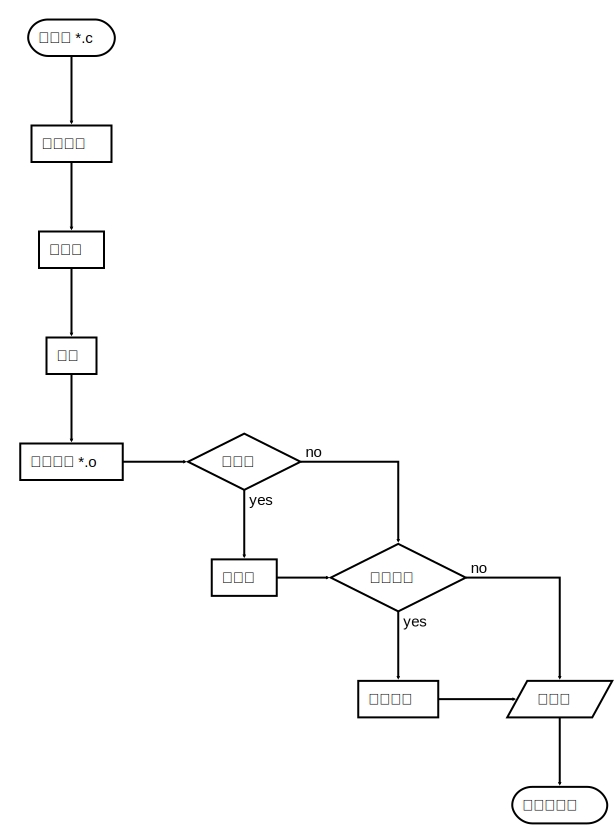

# C语言编译过程

## C程序编译步骤

C代码编译成可执行程序经过4步：

1. 预处理：宏定义展开、头文件展开、条件编译等，同时将代码中的注释删除，这里并不会检查语法
2. 编译：检查语法，将预处理后文件编译生成汇编文件
3. 汇编：将汇编文件生成目标文件(二进制文件)
4. 链接：C语言写的程序是需要依赖各种库的，所以编译之后还需要把库链接到最终的可执行程序中去

<div align="center">
  
</div>


## GCC

1. 分步编译

用途|GCC指令
---|---
预处理|gcc -E hello.c -o hello.i
编  译|gcc -S hello.i -o hello.s
汇  编|gcc -c hello.s -o hello.o
链  接|gcc    hello.o -o hello_elf

选项	|含义
---|---
- E	|只进行预处理
- S(大写)|	只进行预处理和编译
- c(小写)|	只进行预处理、编译和汇编
- o file|	指定生成的输出文件名为 file

文件后缀|含义
---|---
.c	|C 语言文件
.i	|预处理后的 C 语言文件
.s	|编译后的汇编文件
.o	|编译后的目标文件

常见指令|用途
---|---
gcc -E main.c|看到预处理之后、编译之前的程序
gcc -Wall main.c && a.out|执行一下编译后的程序


 ### 查找程序所依赖的动态库

 ```bash
 [pushaowei@local ~]$ ldd /usr/bin/lp
         linux-vdso.so.1 =>  (0x00007fffe8976000)
         libcups.so.2 => /usr/lib64/libcups.so.2 (0x00007f6941e0d000)
         libgnutls.so.26 => /usr/lib64/libgnutls.so.26 (0x00007f6941b6a000)
         libavahi-common.so.3 => /usr/lib64/libavahi-common.so.3 (0x00007f694195e000)
         libavahi-client.so.3 => /usr/lib64/libavahi-client.so.3 (0x00007f694174e000)
         libpthread.so.0 => /lib64/libpthread.so.0 (0x00007f6941531000)
         libm.so.6 => /lib64/libm.so.6 (0x00007f69412ae000)
         libcrypt.so.1 => /lib64/libcrypt.so.1 (0x00007f6941076000)
         libaudit.so.1 => /lib64/libaudit.so.1 (0x00007f6940e53000)
         libselinux.so.1 => /lib64/libselinux.so.1 (0x00007f6940c34000)
         libc.so.6 => /lib64/libc.so.6 (0x00007f69408a8000)
         libgssapi_krb5.so.2 => /lib64/libgssapi_krb5.so.2 (0x00007f6940664000)
         libkrb5.so.3 => /lib64/libkrb5.so.3 (0x00007f694037d000)
         libk5crypto.so.3 => /lib64/libk5crypto.so.3 (0x00007f6940151000)
         libcom_err.so.2 => /lib64/libcom_err.so.2 (0x00007f693ff4d000)
         libz.so.1 => /lib64/libz.so.1 (0x00007f693fd37000)
         libtasn1.so.3 => /usr/lib64/libtasn1.so.3 (0x00007f693fb27000)
         libgcrypt.so.11 => /lib64/libgcrypt.so.11 (0x00007f693f8b2000)
         libdbus-1.so.3 => /lib64/libdbus-1.so.3 (0x00007f693f671000)
         librt.so.1 => /lib64/librt.so.1 (0x00007f693f456000)
         libdl.so.2 => /lib64/libdl.so.2 (0x00007f693f252000)
         /lib64/ld-linux-x86-64.so.2 (0x00007f694205d000)
         libkrb5support.so.0 => /lib64/libkrb5support.so.0 (0x00007f693f047000)
         libkeyutils.so.1 => /lib64/libkeyutils.so.1 (0x00007f693ee44000)
         libresolv.so.2 => /lib64/libresolv.so.2 (0x00007f693ec2d000)
         libgpg-error.so.0 => /lib64/libgpg-error.so.0 (0x00007f693ea29000)
 ```

## CPU内部结构与寄存器

### 64位和32位系统区别
 	- 寄存器是CPU内部最基本的存储单元
 	- CPU对外是通过总线(地址、控制、数据)来和外部设备交互的，总线的宽度是8位，同时CPU的寄存器也是8位，那么这个CPU就叫8位CPU
 	- 如果总线是32位，寄存器也是32位的，那么这个CPU就是32位CPU
 	- 有一种CPU内部的寄存器是32位的，但总线是16位，准32位CPU
 	- 所有的64位CPU兼容32位的指令，32位要兼容16位的指令，所以在64位的CPU上是可以识别32位的指令
 	- 在64位的CPU构架上运行了64位的软件操作系统，那么这个系统是64位
 	- 在64位的CPU构架上，运行了32位的软件操作系统，那么这个系统就是32位
 	- 64位的软件不能运行在32位的CPU之上

### 寄存器名字
8位	|16位|32位|64位
---|---|---|---
A	|AX|	EAX|	RAX
B	|BX|	EBX|	RBX
C	|CX|	ECX|	RCX
D	|DX|	EDX|	RDX

### 寄存器、缓存、内存三者关系

按与CPU远近来分，离得最近的是寄存器，然后缓存(CPU缓存)，最后内存。
CPU计算时，先预先把要用的数据从硬盘读到内存，然后再把即将要用的数据读到寄存器。
于是 `CPU<--->寄存器<--->内存`，这就是它们之间的信息交换。
那为什么有缓存呢？因为如果老是操作内存中的同一址地的数据，就会影响速度。于是就在寄存器与内存之间设置一个缓存。
因为从缓存提取的速度远高于内存。当然缓存的价格肯定远远高于内存，不然的话，机器里就没有内存的存在。
由此可以看出，从远近来看：`CPU〈---〉寄存器〈---> 缓存 <---> 内存`
